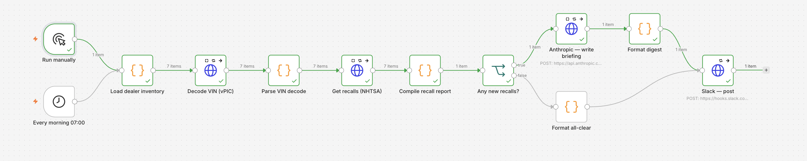
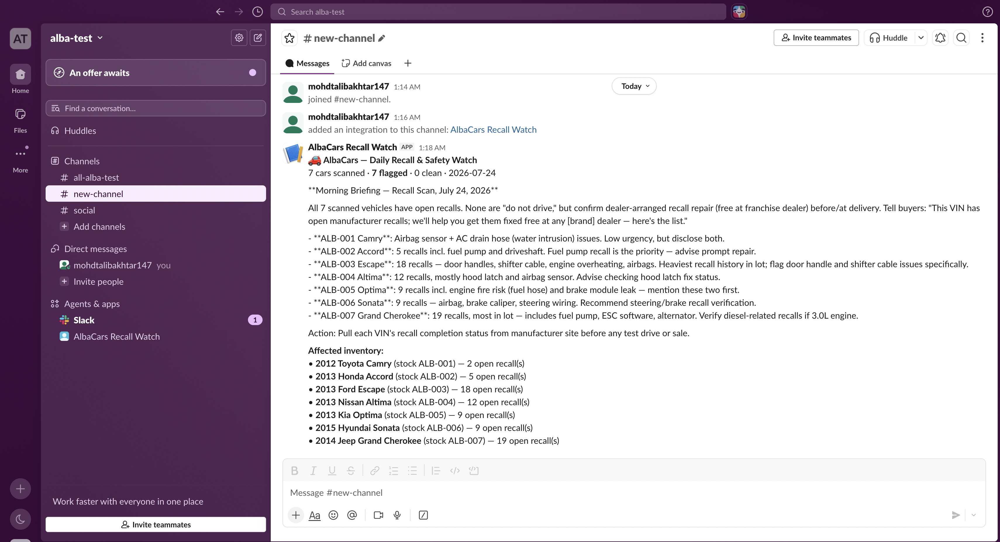

# AlbaCars — Recall & Safety Watch (n8n)

An n8n workflow that gives a used-car dealer a **daily open-recall briefing** on the
cars they have in stock. Every morning it takes the dealership's inventory, checks each
vehicle against the live **NHTSA** safety databases, has an **LLM** write a plain-English
briefing for the sales team, and posts it to **Slack** — and it remembers what it already
reported, so re-running never spams duplicates.

This is the third side of the same product as the other two assignments:
- **Assignment 1 (AutoScope)** uses the same NHTSA safety data for its buyer-facing Safety Check.
- **Assignment 2 (AlbaScope Inventory)** is the dealer console whose `cars` table this workflow reads in production.
- **Assignment 3 (this)** is the automation that watches that inventory for safety issues.

---

## What & why

A used-car dealer's biggest silent liability is selling a car with an **open, unfixed safety
recall**. Recalls are published continuously by NHTSA, but nobody on a busy sales floor
checks them per car. This workflow does it automatically, every morning, and hands the team
a short human-readable briefing: *"3 of your listings have open recalls — here's what to tell
buyers."*

---

## Node-by-node walkthrough

Data flows left → right; each car is processed as its own item until the report is compiled.

| # | Node | Type | What it does |
|---|------|------|--------------|
| 1 | **Run manually** | Manual Trigger | Run on demand (for testing / the reviewer). |
| 2 | **Every morning 07:00** | Schedule Trigger | Cron `0 7 * * *` — the daily production trigger. Both triggers feed the same next node. |
| 3 | **Load dealer inventory** | Code | Emits one item per car in stock (`stockId, vin, make, model, year`). **Sample data, clearly labelled** — in production this is a Supabase read of the AlbaScope `cars` table. |
| 4 | **Decode VIN (vPIC)** | HTTP Request | Live call to NHTSA vPIC (`/decodevin/{vin}`) to enrich each car with body class / engine / plant. Keyless. Retries + `continueOnFail`. |
| 5 | **Parse VIN decode** | Code | Flattens the vPIC `Results` array into clean fields. Degrades gracefully if a VIN is unknown. |
| 6 | **Get recalls (NHTSA)** | HTTP Request | Live call to `api.nhtsa.gov/recalls/recallsByVehicle?make=&model=&modelYear=` — the **second data source**, fused with the decode. Keyless. Retries + `continueOnFail`. |
| 7 | **Compile recall report** | Code | **Aggregates all cars into one report**, computes totals, and applies **idempotency** via n8n workflow static data (remembers already-alerted campaign numbers so re-runs don't re-alert). Also builds the LLM prompt. |
| 8 | **Any new recalls?** | IF | Branches on `carsFlagged > 0`. This is the conditional logic — not a straight line. |
| 9 | **Anthropic — write briefing** | HTTP Request | (true branch) Calls the Anthropic Messages API to write a ~180-word sales-team briefing. Key stored as an n8n credential, **never in the JSON**. Retries + `continueOnFail`. |
| 10 | **Format digest** | Code | Wraps the LLM text + a structured "affected inventory" list into Slack markdown. Falls back to the structured list if the LLM call failed. |
| 11 | **Format all-clear** | Code | (false branch) Builds a short "no new recalls today" message. |
| 12 | **Slack — post** | HTTP Request | Posts the message to a Slack Incoming Webhook. Both branches converge here. |

### Requirements coverage
- **Trigger** — manual + schedule (cron).
- **External data** — two live NHTSA APIs (vPIC decode + recalls), keyless and verifiable.
- **Transformation** — Code/Set reshaping, per-car → aggregated report.
- **Conditional logic** — IF branch (new recalls vs all-clear).
- **Error handling** — every HTTP node has `continueOnFail` + retry/backoff (`maxTries` 3, `waitBetweenTries`); the Code nodes tolerate missing/empty responses, so one bad API call can't kill the run.
- **Verifiable output** — a Slack message you can see land.
- **Bonus** — LLM node · two sources merged · retry/backoff · idempotency (static-data dedupe).

---

## Setup & credentials

Two credentials are needed. **Both are placeholders in this repo — never commit real secrets.**

### 1. Anthropic API key (for the LLM briefing)
- In n8n: **Credentials → New → Header Auth**.
- Name: `Anthropic API (x-api-key)`
- Header **Name**: `x-api-key`
- Header **Value**: `sk-ant-...` (your key)
- Open the **Anthropic — write briefing** node → Authentication → *Generic Credential Type → Header Auth* → select this credential.
- Model defaults to `claude-sonnet-5`; change it in the node's JSON body if your key targets a different model.

### 2. Slack Incoming Webhook (for delivery)
- Create one at <https://api.slack.com/messaging/webhooks> (Slack app → Incoming Webhooks → Add to a channel).
- Copy the URL (`https://hooks.slack.com/services/...`).
- Open the **Slack — post** node and paste it into the **URL** field, replacing the placeholder
  `https://hooks.slack.com/services/REPLACE/WITH/YOUR-WEBHOOK`.

> No keys are required for the NHTSA calls — they are public and keyless.

See [`.env.example`](.env.example) for the placeholder reference.

---

## How to run it

- **Manually:** open the workflow and click **Test workflow** (fires the *Run manually* trigger).
- **On schedule:** toggle the workflow **Active**; it runs every day at 07:00 via the cron trigger.

## How to verify it worked

1. After a run, the canvas shows a green check on every node.
2. Open the **Compile recall report** node's output — you'll see the structured JSON:
   `totalCars`, `carsFlagged`, `totalOpenRecalls`, and a `flagged[]` list with real NHTSA
   campaign numbers (e.g. Ford Escape 2013 returns ~18 recalls).
3. The **Slack channel** receives the digest:
   > 🚗 **AlbaCars — Daily Recall & Safety Watch**
   > 7 cars scanned · **7 flagged** · 0 clean · 2026-07-24
   > *(LLM briefing paragraph…)*
   > **Affected inventory:** • 2013 Ford Escape (stock ALB-003) — 18 open recall(s) …
4. **Idempotency check:** run it a second time — because every campaign was already recorded,
   `carsFlagged` is now 0 and Slack gets the ✅ *all-clear* message instead. (To replay the
   full alert, clear the workflow's static data or edit a `stockId`.)

### Screenshots from a successful run

**The workflow — every node green (manual run):**

**The delivered Slack digest in #new-channel** (real NHTSA recall counts + Claude briefing):

---

## Notes & limitations
- Inventory is a **labelled sample** (7 real US-market vehicles that return real recalls). In
  production the *Load dealer inventory* node is swapped for a Supabase read of the AlbaScope
  `cars` table — the rest of the workflow is unchanged.
- NHTSA recall data is US-market; it's the same public dataset AutoScope's Safety Check uses.
- The LLM briefing is generated per run; if the Anthropic call fails, the Slack message still
  posts with the structured recall list (graceful degradation).
